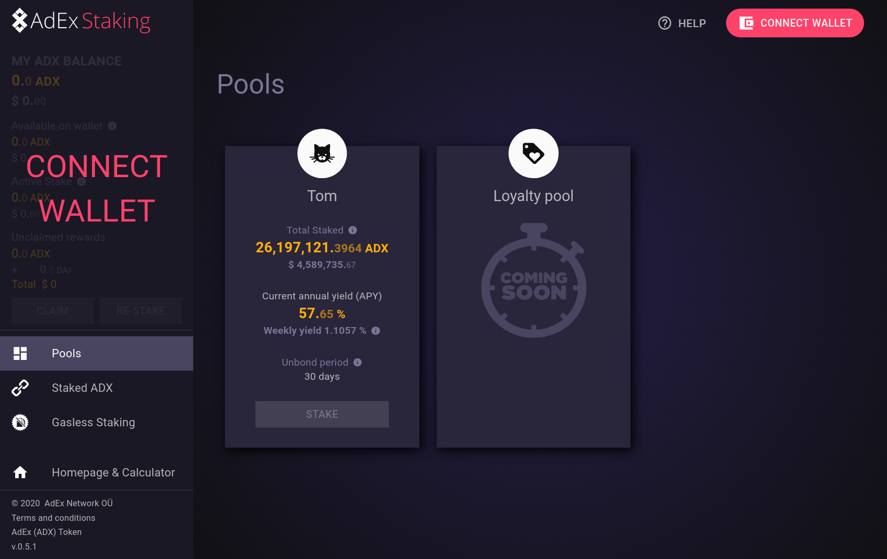
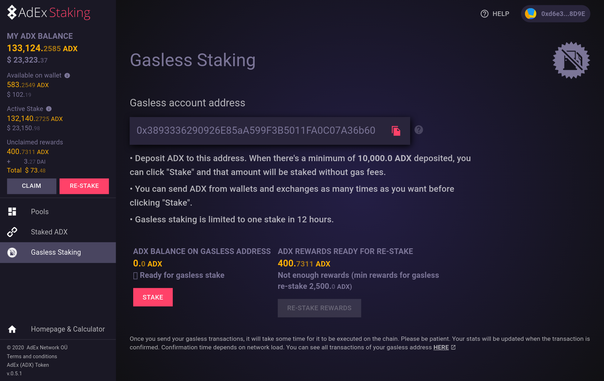

# AdEx Staking UI

## Staking

This is the UI for staking on the [AdEx Registry](https://github.com/adexnetwork/adex-protocol#registry).

It is hosted at [staking.adex.network](https://staking.adex.network), but you may choose to run it locally from source by cloning this repository and running `yarn install && yarn start`.

Smart contracts: https://github.com/adexnetwork/adex-protocol-eth

Terms and conditions: https://www.adex.network/tos/

## Screenshots

### Pools dashboard

### Gasless staking

## Available Scripts

In the project directory, you can run:

### `yarn start`

Runs the app in the development mode. 
Open [http://localhost:3000](http://localhost:3000) to view it in the browser.

The page will reload if you make edits. 
You will also see any lint errors in the console.

### `yarn test`

Launches the test runner in the interactive watch mode. 
See the section about [running tests](https://facebook.github.io/create-react-app/docs/running-tests) for more information.

### `yarn build`

Builds the app for production to the `build` folder. 
It correctly bundles React in production mode and optimizes the build for the best performance.

The build is minified and the filenames include the hashes. 
Your app is ready to be deployed!

### `yarn deploy`

Build and deploy to GitHub pages

